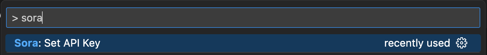

We are happy to introduce Sora, a Visual Studio Code extension that integrates ChatGPT into your editor. While Github Copilot is useful for in-line auto-complete while you are writing code, Sora excels at writing whole files.

We created the extension to compliment Github Copilot. Our goal with Sora is to boost productivity by letting users write specifications and reference files to write code, rather than autocomplete while writing.

## Features

Sora integrates into you Visual Studio Code environment. When you write a comment, you can hover over the comment and click “Send to ChatGPT”. This will take your comment, along with our wrapping prompt, and send it to ChatGPT. The response is parsed and the code is then entered into your file.

You can also type `@ChatGPT` within a comment to send it to ChatGPT as well. The biggest benefit is that file links are also pulled into the prompt for ChatGPT to use as a reference. For example you can say `Use [my test file](./Component.test.tsx) as the tests that this component should pass.` This will take the contents of `Component.test.tsx` and send it as part of the prompt.

Using this extension lets users write specifications as comments, and have ChatGPT write the entire file for you.

## Installation and Usage

You can install the extension by going to [the VSCode Marketplace](https://marketplace.visualstudio.com/items?itemName=CapsuleCat.sora-by-capsule-cat), or searching for “Sora” in Visual Studio Code extensions.

Once installed, you will need to enter your own OpenAI API key. You can get your key by following [these instructions](https://help.openai.com/en/articles/4936850-where-do-i-find-my-secret-api-key). Then just enter `Sora: Set API Key` into the Visual Studio Code command prompt.

You can review the code [on Github](https://github.com/CapsuleCat/sora-by-capsule-cat).

## Conclusion

We are excited to share this VSCode extension! We've been using it for [Dark Emblem](/blog/04-02-2023-dark-emblem-update) and in various other projects.

Please feel free to reach out on our Github for feedback or questions.