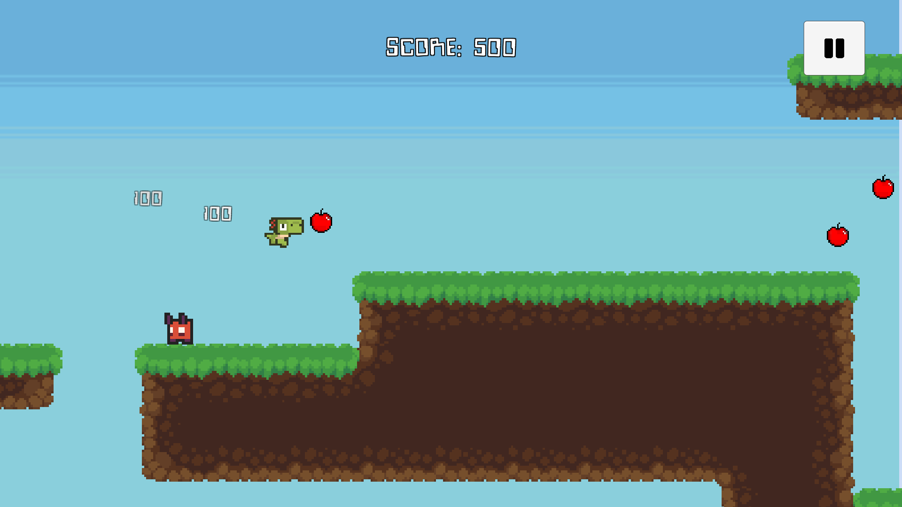
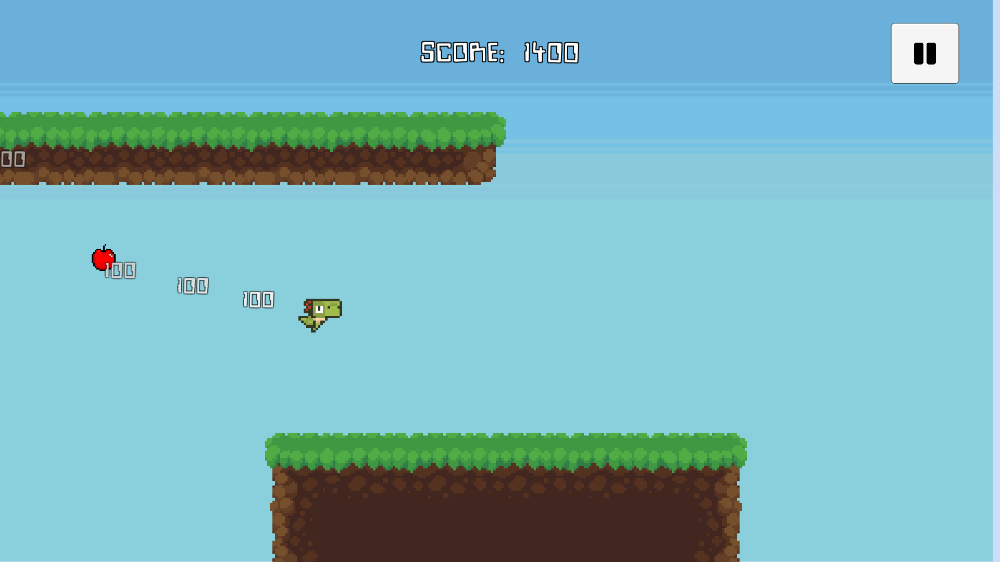
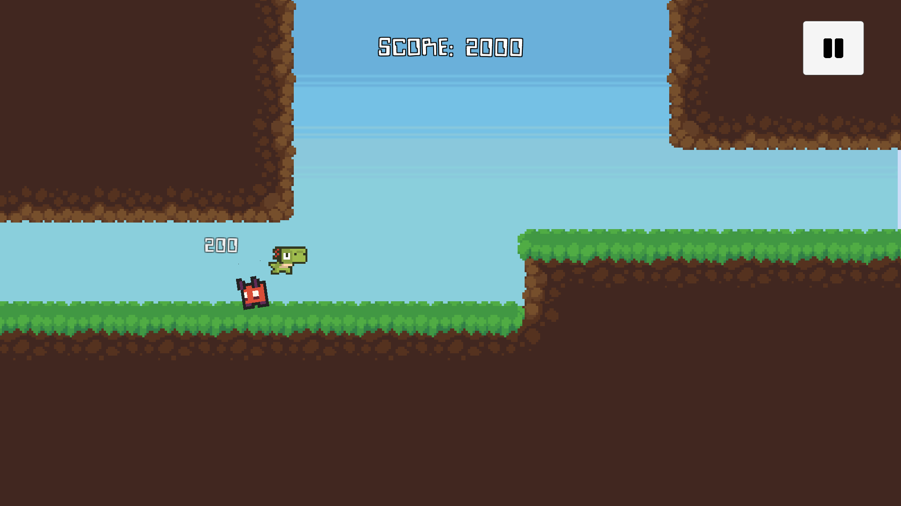
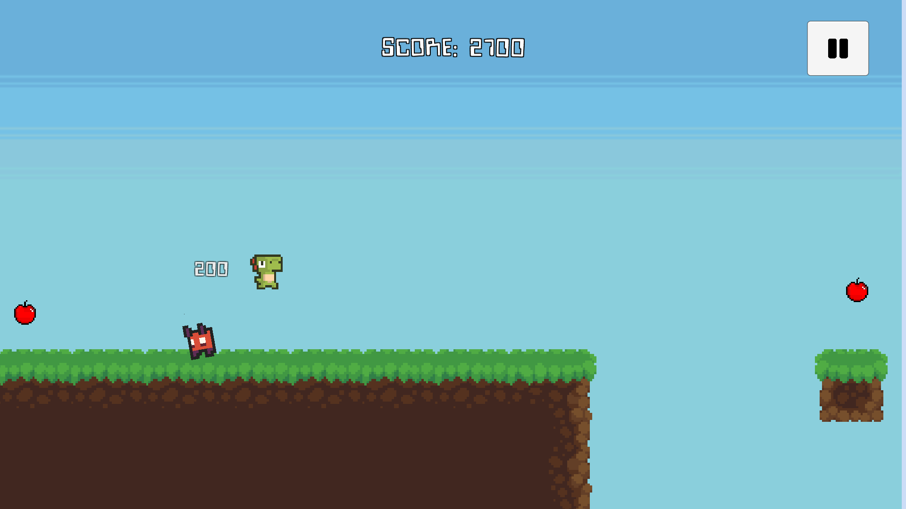
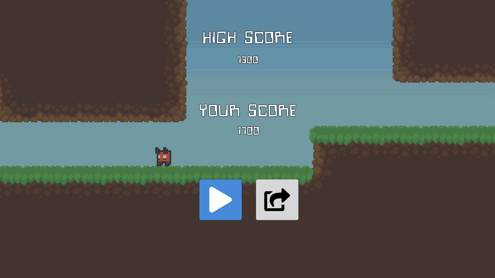

<Container>

<Row>

<Col>

</Col>

<Col xs="10">

<h2>Dino Don</h2>

Jump, dash, and bounce to a better tomorrow.

</Col>

</Row>

</Container>

<!-- Begin Downloads -->

<Box className="bg-light my-5 py-5">

<Container>

<Row>

<Col>

<h3>Play Now</h3>

Play Dino Don for free on your Android or Mac

<PlayButton to="https://play.google.com/store/apps/details?id=com.CapsuleCat.DinoDon" />

<DownloadButton type="mac" file="/downloads/DinoDon.zip" />

</Col>

</Row>

</Container>

</Box>

<!-- Begin Gallery -->

<Container className="mb-5">

<Row>

<Col>

<h3>Gallery</h3>

<FlexGrid>

<GridItem>

<Box className="img img-thumbnail" display="block">

<Image src="./snapshot-00.png" />

</Box>

</GridItem>

<GridItem>

<Box className="img img-thumbnail" display="block">

</Box>

</GridItem>

<GridItem>

<Box className="img img-thumbnail" display="block">

</Box>

</GridItem>

<GridItem>

<Box className="img img-thumbnail" display="block">

</Box>

</GridItem>

<GridItem>

<Box className="img img-thumbnail" display="block">

</Box>

</GridItem>

<GridItem>

<Box className="img img-thumbnail" display="block">

</Box>

</GridItem>

</FlexGrid>

</Col>

</Row>

</Container>